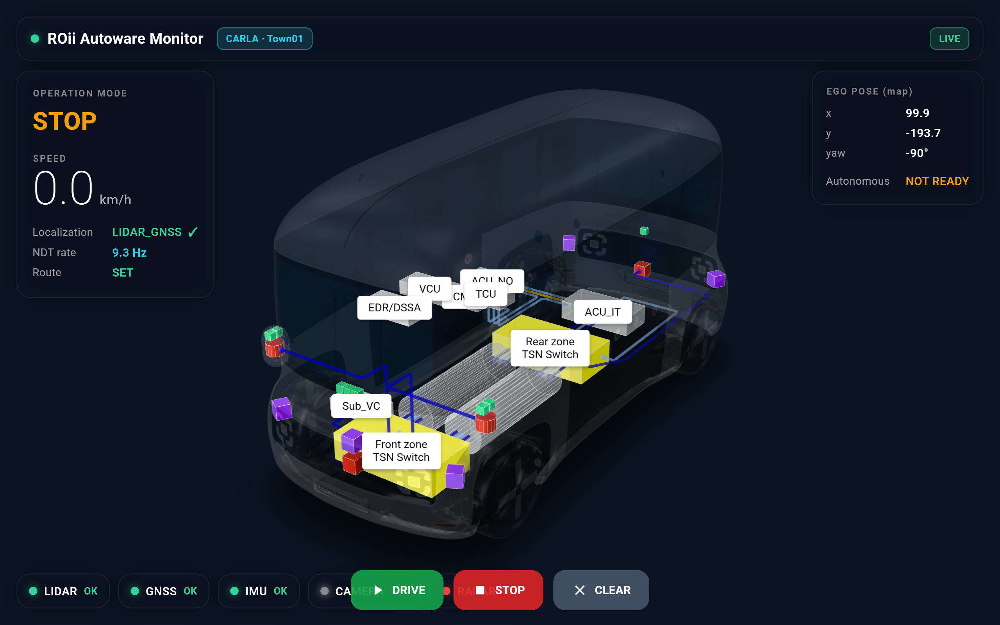

# ROii Autoware Monitor

Android tablet dashboard for a **live Autoware autonomous-driving stack running
against CARLA**, built on the design + base of `pleos_auto_manager`
(3D `roii.glb` model via `model_viewer_plus`, hotspot/fault JS bridge, dark
automotive theme).



## What it does
- **3D ROii vehicle** (`lib/assets/roii.glb`) with component hotspots (TSN
  switches, ACU_IT/NO, VCU, TCU, Sub_VC, LiDARs, radars). A faulted sensor
  pulses red on the model.
- **Live telemetry** from the running Autoware graph (real values, no fakes):
  operation mode, NDT localization + rate, route state, ego map pose,
  autonomous availability, LiDAR/GNSS/IMU health, camera OFF.
- **Manual driving (teleop)** — the ego actually moves in CARLA:
  - **Tilt steering**: roll the tablet left/right (accelerometer) to steer;
    tap the gauge to re-center.
  - **ACCEL pedal** (hold) = forward, **BRAKE pedal** (hold) = reverse/brake.
- **Autonomy buttons** (top-right): DRIVE (set route + engage), STOP, CLEAR.

## Architecture
```
CARLA 0.9.16 ──(autoware_carla_interface)──> Autoware (ROS 2 Humble)
                                                  │
                              ros/ros_ws_gateway.py (in the autoware repo)
                                       │  WebSocket :8765/ws (JSON state, 2 Hz)
                                       │  + commands {cmd:drive|stop|clear|teleop}
                                       ▼
                              ROii Autoware Monitor (this Flutter app)
```
- `services/ws_monitor_service.dart` — WebSocket client (auto-reconnect) + send.
- `models/autoware_state.dart` — frame parser.
- `providers/monitor_provider.dart` — Riverpod stream + gateway URL.
- `screens/autoware_monitor_screen.dart` — 3D model + overlays + controls.
- `screens/widgets/{status_overlay,drive_controls}.dart` — dashboard + pedals/tilt.

## Run
```bash
# 1) bring up CARLA + Autoware + gateway + rviz (one command, in the autoware repo)
bash scripts/run_localization_demo.sh Town01

# 2) tablet over USB
adb reverse tcp:8765 tcp:8765
flutter build apk --debug && adb install -r build/app/outputs/flutter-apk/app-debug.apk
#   Wi-Fi instead: set gatewayUrlProvider to ws://<host-ip>:8765/ws
```
Verified live on Samsung SM-T736N (Galaxy Tab S7 FE, Android 14): real ego pose
matches Autoware to 2 decimals; tilt + pedal teleop drives the ego (tracked by
NDT, shown in rviz + app).

## Notes
- Cameras are OFF (ROii runs LiDAR + radar; 6 RGB cameras crash CARLA on attach).
- Full autonomous (tap-goal → self-drive) is limited by single-box resources;
  manual teleop is the reliable "drive the car" path. See the `autoware` repo's
  `docs/autoware_carla_integration.md` for the full integration story.
