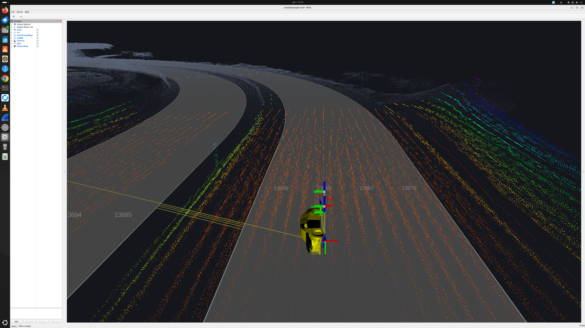

# Soongsil rosbag Replay + HMI (이중측위 / Multimode)

숭실대에서 전달받은 **CARLA(Town04) 기반 ROS 2 bag**을 재생하면서, RViz와 HMI 앱
(`com.keti.soongsil`)을 함께 구동하는 데모입니다. CARLA·Autoware 전체 스택을 실행하지
않고 **bag에 기록된 토픽만 재생**하며, HMI는 자체 **ROS 2 → WebSocket 게이트웨이**
(`../ros/ros_ws_gateway.py`, ws:8765)를 통해 상태를 받습니다.



## 실행

```bash
bash run_soongsil.sh
# 인자로 bag 경로 지정 가능 (기본: 컨테이너 /root/autoware_map/rosbag)
```

`run_soongsil.sh`가 하는 일:
1. `docker stop/start autoware` — 남아있는 재생 프로세스 확실히 정리
2. `soongsil.rviz` + 차량모델 메쉬(아래 참고)를 컨테이너에 복사/등록
3. **`ros2 bag play <bag> --loop`** (한 개만) — `--clock` 없음(아래 참고)
4. 게이트웨이(`use_sim_time`) → ws:8765 → HMI
5. RViz(`soongsil.rviz`, `use_sim_time`) on DISPLAY :1
6. `adb reverse tcp:8765` + `com.keti.soongsil` 실행

## bag 토픽 구성 (547 topics / 318,887 msgs / 92.3 s / CARLA Town04)

### 측위 (Localization) — 이중측위(multimode)의 핵심
| Topic | Type | 설명 |
|---|---|---|
| `/localization/kinematic_state` | nav_msgs/Odometry | 최종 융합 위치·속도 (통합 EKF) |
| `/localization/pose_twist_fusion_filter/lidar/kinematic_state` | nav_msgs/Odometry | **LiDAR 단독 측위** |
| `/localization/pose_twist_fusion_filter/gnss/kinematic_state` | nav_msgs/Odometry | **GNSS 단독 측위** |

→ HMI는 LiDAR·GNSS 두 측위의 **실시간 편차(LiDAR↔GNSS m)**를 표시해 이중측위 신뢰도를 나타냅니다 (녹색<1 m / 황색<3 m / 적색).

### 차량 상태 / 센서
| Topic | 설명 |
|---|---|
| `/vehicle/status/velocity_status`, `/vehicle/status/steering_status` | 속도·조향각 |
| `/sensor/gnss` (NavSatFix), `/sensing/gnss/pose_with_covariance` | GNSS |
| `/sensor/imu`, `/sensing/imu/imu_data` | IMU |
| `/sensing/camera/traffic_light/image_raw` | 전방 카메라(신호등용) |
| `/localization/util/downsample/pointcloud` | LiDAR 포인트클라우드 |

### 인지 / 계획 / 제어
| Topic | 설명 |
|---|---|
| `/perception/object_recognition/...` | 주변 차량·객체 인식 |
| `/perception/traffic_light_recognition/traffic_signals` | 신호등 인식 결과 |
| `/planning/scenario_planning/trajectory` | 주행 궤적 |
| `/planning/velocity_factors/traffic_light` | 신호등 감속 요인 |
| `/control/command/control_cmd` | 차량 제어 명령 |

### 지도 / 시스템
| Topic | 설명 |
|---|---|
| `/map/pointcloud_map`, `/map/vector_map` | PCD 지도 / 차선(lanelet2) 지도 |
| `/tf`, `/tf_static`, `/robot_description` | 좌표변환 · 차량 URDF |
| `/clock` | 재생 시간 동기화 (아래 참고) |

## 트러블슈팅 (실제로 겪은 것)

- **RViz가 미친 듯이 깜박이고 TF가 날아감** → bag에 **`/clock`이 이미 녹화**(736개)돼 있어
  `ros2 bag play --clock`이 합성 clock을 하나 더 발행 → 두 clock이 충돌해 시각이 계속 뒤로 튐
  → `Detected jump back in time. Resetting RViz`가 ~130 ms마다 반복. **해결: `--clock` 제거**
  (녹화된 `/clock`이 `use_sim_time` 노드를 구동). 확인: `ros2 topic info /clock` publisher == 1,
  `grep -c "jump back" /tmp/rviz.log` == 0.
- **3D 뷰가 검게 깜박임** → 지속 배경이 없어서. `soongsil.rviz`가 `/map/pointcloud_map`
  (2.49 M pts, Transient Local)을 배경으로 깔고 라이다 Decay를 1.0으로 둬 항상 장면이 보임.
- **차량 3D 모델이 안 뜸** → bag의 URDF가 `package://carla_vehicle_description/mesh/carla_t2_ftm.dae`
  (CARLA 패키지, 컨테이너에 없음)를 참조. `run_soongsil.sh`가 이 경로를 번들 `lexus.dae`로
  별칭 + ament index 등록(idempotent) → RobotModel이 base_link에 차량 표시.
- **재생 프로세스가 안 죽음** → `pkill -f 'bag play'`는 잘 놓침(오히려 늘기도). `docker stop autoware`가
  확실. (`pgrep -c` 는 bash 래퍼+python CLI를 이중 카운트하니 실제 신호는 `/clock` publisher 수.)

## 구성 파일
- `run_soongsil.sh` — 원-샷 실행 스크립트
- `soongsil.rviz` — ego 추종 뷰 (맵 클라우드 + 라이다 + 차량모델 + 이중측위)
- `soongsil_hmi/` — HMI 앱 `com.keti.soongsil` (Flutter, LiDAR↔GNSS 편차 표시)
